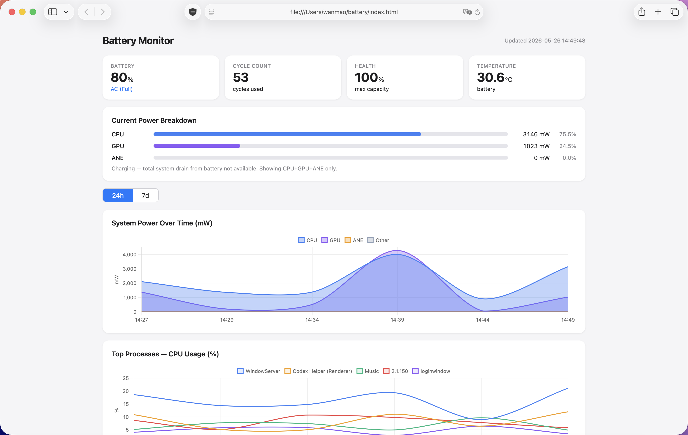

# battery-monitor

Local battery power dashboard for macOS (Apple Silicon & Intel).

Monitors **which processes and hardware components are draining your battery**, and renders everything as a self-refreshing local HTML page at `~/battery/index.html`.



## What it shows

**Current power breakdown**
- CPU / GPU / ANE power in mW (real values from `powermetrics`)
- Other (display + keyboard + network + storage) — available when on battery

**Charts (24h / 7d toggle)**
- System power over time — stacked area: CPU, GPU, ANE, Other
- Top processes by CPU % — which apps are keeping the chip busy
- Battery temperature — with warn/critical threshold lines
- Battery level %

**Process table**
- CPU %, estimated CPU mW, CPU ms/s, PID for the top 20 processes

## Requirements

- macOS 12+ (Apple Silicon recommended, works on Intel)
- Python 3 (`brew install python` if missing)
- `~/.local/bin` on your `$PATH`

## Install

```sh
git clone https://github.com/wanmaoor/battery-monitor.git
cd battery-monitor
./install.sh
```

The installer will:
1. Copy scripts to `~/.local/bin/`
2. Add a sudoers rule to allow passwordless `powermetrics`
3. Install a LaunchAgent that runs every 5 minutes
4. Open the dashboard at `~/battery/index.html`

> **Note:** The sudoers rule is scoped to `/usr/bin/powermetrics` only — no other command is granted elevated access.

## Dashboard

Open `~/battery/index.html` in any browser. The page is regenerated every 5 minutes automatically. Reload to see fresh data.

The dashboard requires an internet connection to load [Chart.js](https://www.chartjs.org/) from CDN.

## How it works

```
LaunchAgent (every 5 min)
  └→ battery-drain-monitor --once
        ├─ sudo powermetrics → CPU mW, GPU mW, ANE mW, per-process CPU ms/s
        ├─ ioreg → battery Amperage × Voltage → total system drain (on battery)
        └─ battery-report-gen
              ├─ writes ~/.local/state/battery-drain-monitor/drain_sys.csv
              ├─ writes ~/.local/state/battery-drain-monitor/drain_procs.csv
              └─ generates ~/battery/index.html
```

Temperature data is read from `battery-temp-monitor`'s `status.log` if you have [battery-temp-monitor](https://github.com/wanmaoor/battery-temp-monitor) installed. Otherwise the temperature chart is simply empty.

## Configuration

Edit `~/.config/battery-drain-monitor/config`:

```sh
# Number of processes to track per sample
BATTERY_DRAIN_MONITOR_TOP_N=20

# powermetrics sampling window in milliseconds (longer = more accurate)
BATTERY_DRAIN_MONITOR_SAMPLE_MS=3000

# Where to write data and the HTML report
BATTERY_DRAIN_MONITOR_STATE_DIR=~/.local/state/battery-drain-monitor
BATTERY_DRAIN_MONITOR_REPORT_DIR=~/battery
```

## Uninstall

```sh
launchctl unload ~/Library/LaunchAgents/com.$USER.battery-drain-monitor.plist
rm ~/Library/LaunchAgents/com.$USER.battery-drain-monitor.plist
rm ~/.local/bin/battery-drain-monitor ~/.local/bin/battery-report-gen
sudo rm /etc/sudoers.d/battery-monitor
rm -rf ~/.local/state/battery-drain-monitor ~/battery
```

## Why total power is unavailable while charging

When plugged in, the battery reports `Amperage = 0`, so the formula `|Amperage| × Voltage` gives zero. CPU + GPU + ANE are still measured accurately; only the "Other" and "Total" values require discharge data.

## License

MIT
